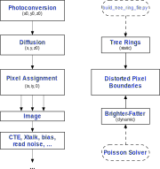

Features Implemented in imSim
#############################

This summary table should give a high level overview of effects. For detailed information please make/link to a subpage or appropriate reference.

Go directly to:
`Sensors <Sensor Table_>`_ - `Sky <Sky Model_>`_ - `Throughputs <System Throughputs_>`_ - `Atmospheric <Atmospheric Model_>`_ - `Optics <Optical Model_>`_  - `Calibration Products <Calibration Products_>`_

Sensor Table
------------

This table is a list of current and not yet implemented
sensor effects in imSim along with pointers to the techniques used to
implement them and the internal validation tests that have been
peformed.

.. list-table::
   :widths: 10 10 10 15 15
   :header-rows: 1

   * - Effect
     - Implementation
     - Data / Model Source
     - Short description
     - Validation Page and Notebooks

   * - Brighter Fatter
     - GalSim Feature (Silicon.cpp)
     - Linear scaling of pixel edge vertices displacement derived with Poisson Solver. Pre-computed solutions available for both E2V and ITL sensors, with both 8 and 32 vertices per edge.
     - GalSim reads in vertex data from full electrostatic Poisson solver, scales them linearly with collected charges, and co-adds the effects from all pixels iteratively while collecting the image.
     - Page link :doc:`validation/brighter-fatter`

   * - Diffusion
     - GalSim Feature (sensor.py / Silicon.cpp)
     - Diffusion Parameters estimated from first principles and validated with Fe55
     - GalSim applies random Gaussian displacement for every photon using temperature and voltage dependent amplitude,  See page link
     - Page link :doc:`validation/diffusion`

   * - Tree Rings
     - GalSim Feature (Silicon.cpp) / imSim configuration (tree_rings.py)
     - Analytic model is used to pre-compute 189 unique sensor models with randomized parameters empirically based on BNL acquired data.
     - Radial displacement profile is modelled as a sum of 40 sinusoids modulated by a power law function.
     - :doc:`validation/tree-ring`

   * - CTE
     - readout.py
     -
     -
     -

   * - Noise Rate
     - readout.py
     -
     -
     - Noise rate is YYY

   * - Xtalk
     - readout.py
     - Currently Unknown
     -
     - Crosstalk values are read from obs_lsst.

   * - Hot Pixels/Rows
     - See Note
     -
     -
     - We will mask locations without actually simulating them.

   * - Fringing
     - Not yet
     -
     -
     - Some formalism and a standalone simulation
       `here <https://confluence.slac.stanford.edu/pages/viewpage.action?pageId=215845587>`__.
       The hooks to implement code for this in exist now in the GalSim API (more info needed)

   * - Cosmic Rays
     - cosmic_rays.py: Approximately 10K cosmic rays which are randomly addd to
       the exposures can be be found in cosmic_ray_catalog.fits.gz
     - Template data taken from ITL test stands at UofA.
     -
     - We should normalize to mountain level.

   * - Edge rolloff
     - Not yet
     -
     -
     -

   * - Bleeding
     - Not yet
     - Test stand at Davis. Specialized bleed run.
     -
     - Current tests are exploring behavior at the midline for ITL and E2V sensors

   * - Spider Diffraction
     - diffraction.py, photon_ops.py
     -
     - Statistical Diffraction during batoid ray tracing.
     - Page link :doc:`validation/diffraction`

Sky Model
---------

imSim uses the project sky model. It is located in the sims stack and called
sims_skybrightness.

.. list-table::
   :widths: 10 10 10 15 15
   :header-rows: 1

   * - Effect
     - Implementation
     - Data / Model Source
     - Short description
     - Validation Page and Notebooks

   * - Sky Background
     - LSST eups package `git repo <https://github.com/lsst/sims_skybrightness>`_
     - Based on the `ESO sky brightness model <http://www.eso.org/observing/etc/bin/gen/form?INS.MODE=swspectr+INS.NAME=SKYCALC>`_
       and all-sky camera data from LSST site for twilight sky.
     - The model includes light from twilight (scattered sunlight), zodiacal light
       (scattered sunlight from SS dust), scattered moonlight, airglow, and emission lines
       from the upper and lower atmosphere. The model can return SEDs or
       magnitude per sq arcsec in LSST filters.
     - Validation plots can be found in the `SPIE paper <https://ui.adsabs.harvard.edu/#abs/2016SPIE.9910E..1AY/abstract>`_.
       Note the model does not include any "weather" (e.g., clouds, variable OH emission).
       There is an option to change the solar activity, which scales the airglow component.

System Throughputs
-------------------

All of the system throughputs are recorded in
`baseline <https://github.com/lsst/throughputs/tree/master/baseline>`_.
This information is copied from the System Engineering database.  More information can be
found in the `README <https://github.com/lsst/throughputs/blob/master/baseline/README.md>`_ file.
In that directory you can find a graphical representation of the total throughput along with datafile
representing each component and the total throughput. The file representing each throughput curve is
referenced below. [It looks like the README might be a bit out of date with the files..
We need more research then we can add more information to a detailed page for each]

.. list-table::
   :widths: 10 10 10 15 15
   :header-rows: 1

   * - Effect
     - Implementation
     - Data / Model Source
     - Short description
     - Validation Page and Notebooks

   * - Camera QE and AR
     - detector.dat
     - SysEngineering 1.1
     - Expected response (QE response + AR coatings) of the CCDs provided by each of the two
       vendors under consideration.
     - We expect a merge from the SysEng database very soon.

   * - Lens
     - lens[1,2,3].dat
     - SysEngineering 1.1
     - Combination of fused silicon and BroadBand AntiReflective (BBAR) coatings
     -

   * - Filters
     - filter[u,g,r,i,z,y].dat
     - SysEngineering 1.1
     - Filter throughput in each band (from manufacturer?)
     -

   * - Mirrors
     - m[1,2,3].dat
     - SysEngineering 1.1
     - Reflectivity curve for each mirror
     -

   * - Atmosphere
     - atmosphere_std.dat and atmosphere_10.dat
     - SysEngineering 1.1
     - MODTRAN based standard US atmosphere with Aerosols added.
     - Both typical (standard) throughput with airmass X=1.2 and optimum X=1.0 files are provided

   * - Total
     - total[u,g,r,i,z,y].dat
     - SysEngineering 1.1
     - The total throughput by band
     -

[What about darsky.dat? Do we use this, now that we have the ESO model?
Or is this used by OpSim?  Should we include it?  What is hardware[u,g,r,i,z,y].dat?]

Atmospheric model
-----------------

.. list-table::
   :widths: 10 10 10 15 15
   :header-rows: 1

   * - Effect
     - Implementation
     - Data / Model Source
     - Short description
     - Validation Page and Notebooks

   * -
     -
     -
     -
     -

Optical model
-------------

.. list-table:: Sky Model
   :widths: 10 10 10 15 15
   :header-rows: 1

   * - Effect
     - Implementation
     - Data / Model Source
     - Short description
     - Validation Page and Notebooks

   * - Vignetting
     - Not yet
     -
     -
     -

   * - Ghosts
     - Not currently possible
     -
     -
     - There is currently no optical ray trace

   * - Aberrated optics
     - optical_system.py
     - Sensitivity matrix from LSST SE LCA-XXX
     - Difference from AO corrected mean represented as a sum of Zernikes contributing a phase screen.
     - Page link :doc:`validation/aberrated-optics`

Calibration Products
--------------------

.. list-table::
   :widths: 10 10 10 15 15
   :header-rows: 1

   * - Effect
     - Implementation
     - Data / Model Source
     - Short description
     - Validation Page and Notebooks

   * -
     -
     -
     -
     -

Detailed Physical Effects Implemented in imSim
----------------------------------------------

.. toctree::
   :maxdepth: 2
   :glob:

   validation/*
