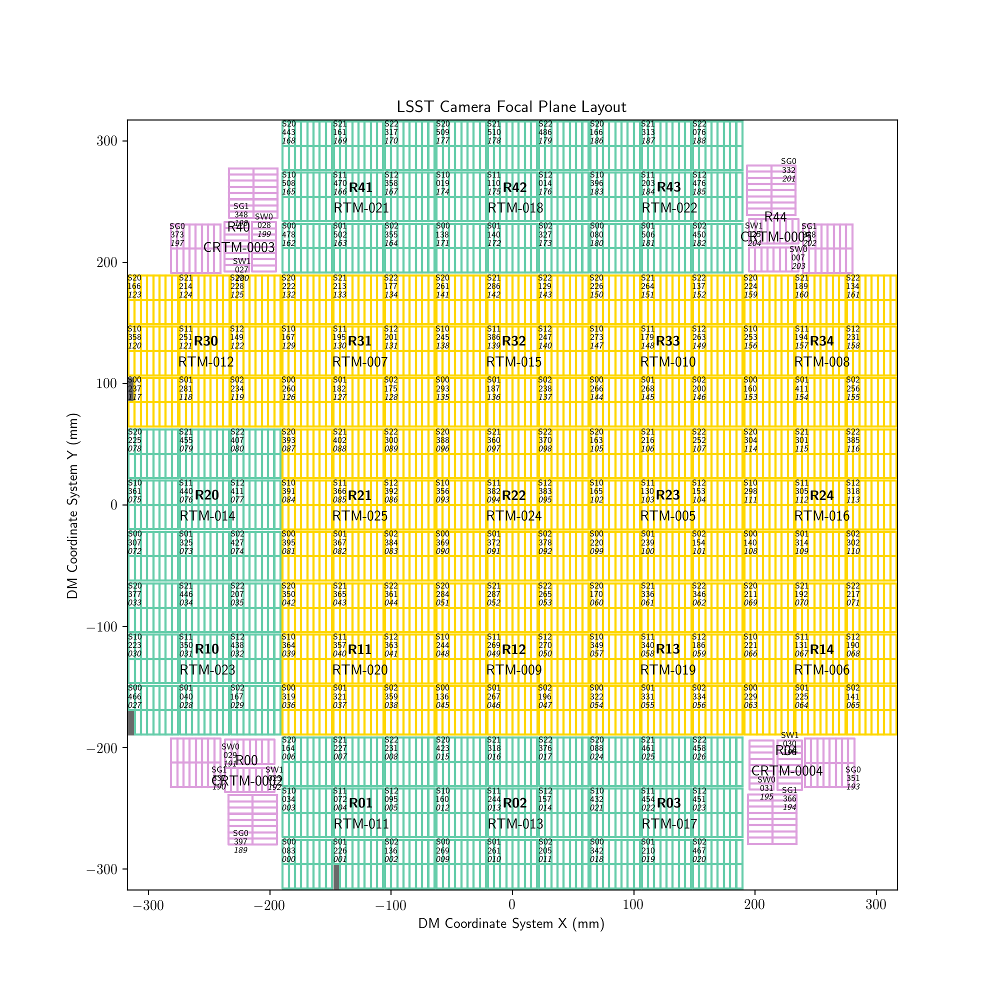

===============================
Understanding the LSST Camera
===============================

.. note::

    This section will contain an image of the focal plane, a description of the sensor numbering scheme, and how to specify sensors to simulate in the YAML input files.

The Camera Layout
-----------------

Specifying which sensors to simulate
------------------------------------

