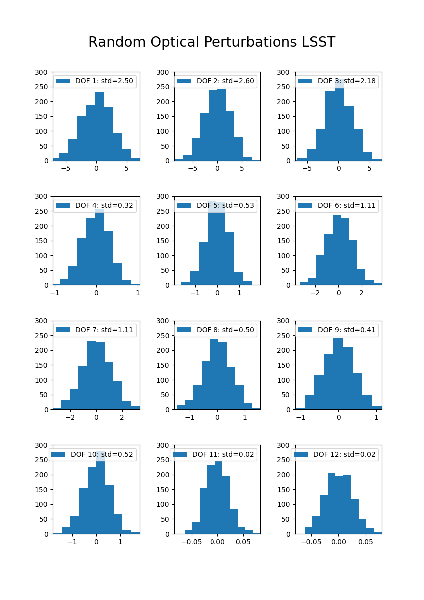
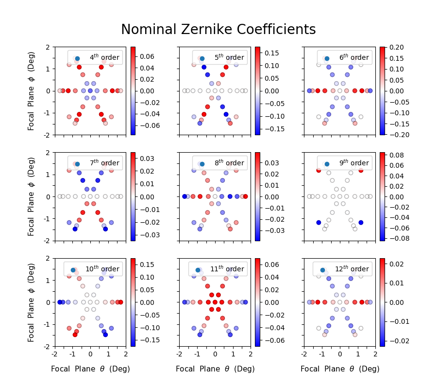
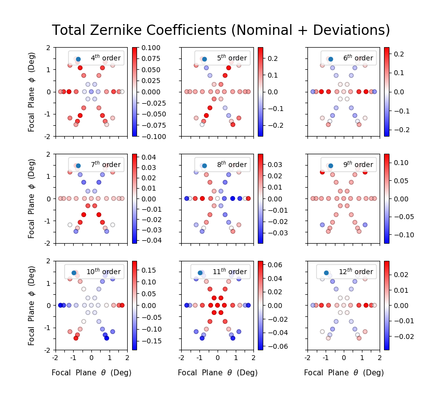
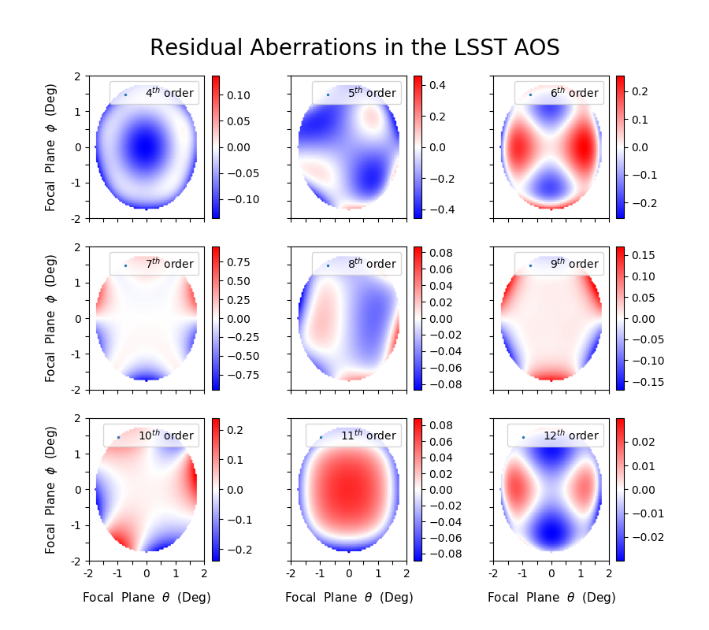

Effect: Abberated Optics
########################

(Parameteric Version)

The LSST active optics system (AOS) is designed to minimize optical
aberrations by modifying the positions and surface figures of
telescope components in real time. The LSST AOS is comprised of two
separate systems. The **open** loop control system uses a lookup table
to compensate for errors that are constant in time. These errors are
mostly comprised of errors in the fabrication and construction of
LSST. The **closed** loop control system uses wavefront sensors to
detect slowly varying optical aberrations. This includes thermally and
gravitationally induced shifts and low spatial order surface errors
for each optical element.

In the ideal case the AOS would be able to remove all optical
aberrations introduced by the LSST optics system. However, in practice
there are small, residual deviations that contribute to the PSF. Our
goal is to simulate these residual errors and determine the induced
optical aberrations. At present, we restrict ourselves to considering
errors left uncorrected by the closed-loop control system. This does
not include errors introduced by noise in the closed loop corrections.

Contact person(s) if any:
-------------------------

Daniel Perrefort, Aaron Roodman, Josh Meyers, Bo Xin

Reference Material:
-------------------

1.  The aberrated optics modeled by ImSim is based on the LSST
    adaptive optics system (AOS) as outlined in `Angeli, Xin et. al
    2014 <https://www.spiedigitallibrary.org/conference-proceedings-of-spie/9150/1/Real-time-wavefront-control-system-for-the-Large-Synoptic-Survey/10.1117/12.2055390.short?SSO=1>`_
2.  A general overview on wavefront aberrations can be found in Aron
    Roodman's `DE School talk
    <http://www.lsst-desc.org/DEschool#roodman>`_ from 2016.

Data Provenance:
----------------

1.  Zemax estimates for the nominal state of the LSST optics system
    were provided by Aaron Roodman
2.  Values for the sensitivity matrix outlined in `Angeli, Xin et. al
    2014 <https://www.spiedigitallibrary.org/conference-proceedings-of-spie/9150/1/Real-time-wavefront-control-system-for-the-Large-Synoptic-Survey/10.1117/12.2055390.short?SSO=1>`_
    were provided by Bo Xin.

Model Details:
--------------

Optical aberrations can be described by a superposition of Zernike
Polynomials :math:`Z_i`. These
polynomials form a complete set of functions, each of which represents
a unique optical aberration. For coordinates :math:`(x,y)` in the
focal plane of LSST and :math:`(u,v)` in the exit pupil, we write this
superposition as

.. math::

   W(u,v,x,y) = \sum_i a_i(u,v) Z_i(x,y)

Note that the coefficients :math:`a_i` are position
dependent. Given an arbitrary coordinate, these coefficients provide a
description of the strength and phase of each aberration introduced by
the optics system. We can express these coefficients in terms of their
nominal value :math:`n_i` and deviations from that nominal value
:math:`\delta n_i`.

.. math::

   W(u,v,x,y) = \sum_i \left(n_i(x,y)
    + \delta n_i(x,y)\right) Z_i(u,v).

The nominal Zernike coefficients are estimated using the Zemax
model. These will differ slightly from the real LSST, however an
“as-built” Zemax model will not be available until closer to the
completion of construction.

Since we are only considering slowly changing optical errors, in the
present context :math:`\delta n_i` represents the residual aberrations
from the closed loop system.

The AOS consists of 50 degrees of freedom which are varied by the
closed loop system.
Deviations in each degree of freedom are represented by a set of 50
normal distributions.
From these distributions, the aberrated optics model generates a
random set of optical deviations representing an independent state of
the LSST optics system. These deviations are then mapped to the
corresponding Zernike coefficients using the sensitivity matrix
:math:`A` outlined in `Angeli, Xin et. al
2014 <https://www.spiedigitallibrary.org/conference-proceedings-of-spie/9150/1/Real-time-wavefront-control-system-for-the-Large-Synoptic-Survey/10.1117/12.2055390.short?SSO=1>`_

The sensitivity matrix, and by extension :math:`\delta_n`, has been
simulated for 35 positions in the LSST focal plane. In order to
determine :math:`a_i` at an arbitrary location, we perform a 2-D fit
for each Zernike coefficient in position space. Since the Zernike
polynomials are a complete set of functions in a circular aperture, we
use a superposition of Zernike polynomials to perform this fit. Note
that this superposition is not the same as the first Equation above.

Validation Criteria:
--------------------

Completed Checks
~~~~~~~~~~~~~~~~

1.  For zero deviations from the nominal state, the aberrated optics
    model should return values in agreement with current Zemax
    estimates. This condition is enforced in the ImSim test suite.
2.  Random samples of optical deviations should form a normal
    distribution centered on zero. This represents our expectation that
    the optical system will (on average) oscillate around the nominal
    state.

Uncompleted Checks
~~~~~~~~~~~~~~~~~~

3.  The average PSF due strictly to the optical system should be
    physically reasonable over a large collection of random optical states.

Validation Results:
-------------------

Condition (2) is demonstrated for a subset of optical degrees of
freedom in Figure 1. Figure 2 demonstrates the Zernike Coefficients
corresponding to the LSST optical system's nominal state. Figures 3
and 4 demonstrate the Zernike coefficients derived for a random set of
deviations in each degree of freedom, both sampled discreetly and
fitted using a superposition of Zernike Polynomials.

    A set of 1000 perturbations in the LSST optical system that cause
    deviations from the nominal state (zero). Demonstrated for the
    first twelve optical degrees of freedom, these deviations are
    derived from a set of unique Gaussian distributions centered at
    zero. Units vary depending on the degree of freedom.

    A set of nominal Zernike Coefficients sampled for 35 locations in
    the exit pupil of LSST. These coefficients collectively represent
    the nominal state of the LSST optical system. Coefficients are
    shown in units of observed wavelength.

    A set of randomly generated Zernike Coefficients for 35 locations
    in the exit pupil of LSST. These coefficients include random
    deviations from the nominal state and represent a distinct state
    of the LSST optical system. Coefficients are shown in units of
    observed wavelength.

    A two dimensional fit of randomly generated Zernike Coefficients
    in the exit pupil of LSST. Coefficients are shown in units of
    observed wavelength.

Known Issues
------------

Progress on improvments to this model are currently being tracked in
issue `LSSTDESC/imSim#128
<https://github.com/LSSTDESC/imSim/issues/128>`_. Please see this
issue for the most up to date information.

In LSSTDESC/DC2-production#259 it was pointed out that the modeled
PSF's are too round. Some of this was attributed to identified bugs,
but it did not fully solve the problem. The issue mentions that the
undersampling of the focal plane might effect the ellipticity of the
optical PSF by introducing vertical and horizontal symmetry. In
particular, the sampling points happen to be at the nodes of Z19, and
the peaks/valleys of Z18 (see
https://www.telescope-optics.net/images/zernike_noll.PNG)

It was also pointed out that the modeled deviations might be too close
to the nominal optical model, and we need to allow more variation in
the simulated deviations. The current optical model only considers a
small part of the deviations that the optical system will
introduce. Since we are specifically modeling effects that are
uncorrected by the closed-loop system - which handles slowly varying
errors - our models are only an approximation.

As a temporary stop-gap PR `LSSTDESC/imSim#164
<https://github.com/LSSTDESC/imSim/issues/164>`_ reduces the FoV
fitting function from Z4 through Z22 to Z4 through Z15. It also
multiplies amplitudes of the optics misalignments by an artificial
factor of 3.
