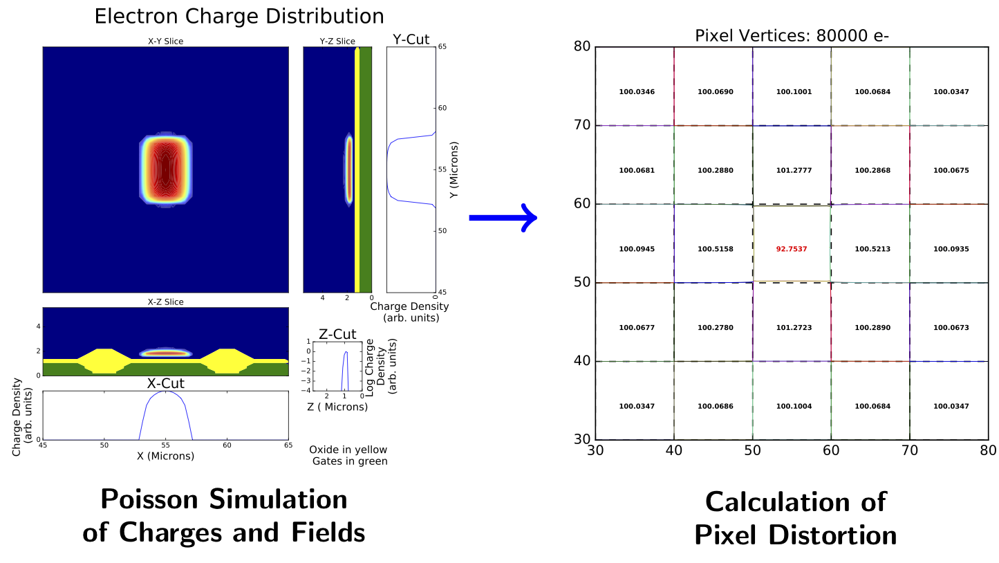
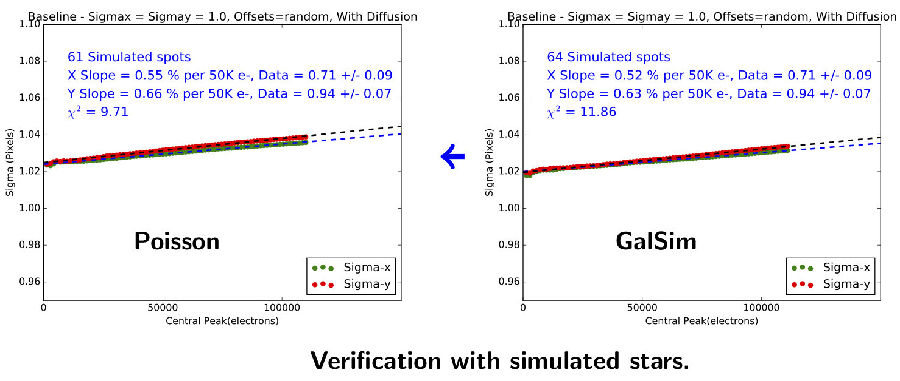
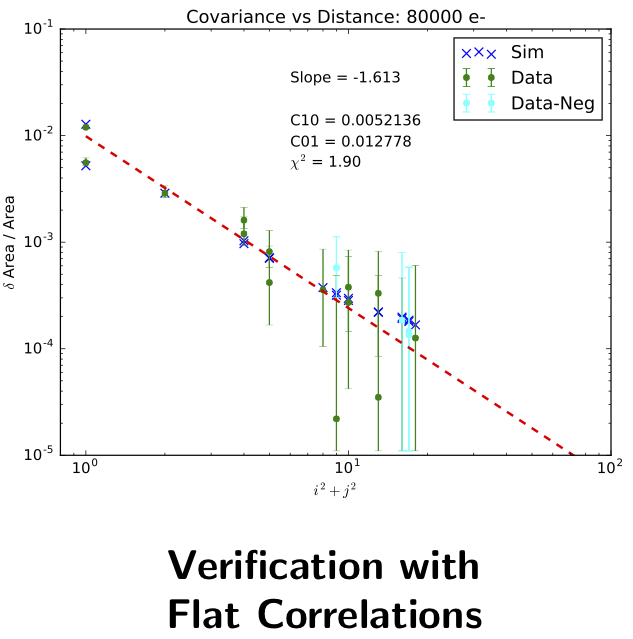

Effect: Brighter-Fatter
#######################

"Brighter-Fatter" is an effect of increase of PSF size for brighter objects, attributed to the repulsion of incoming electrons by the charge already collected inside the pixel.

Useful introduction may be found in
`Walter (2015) <https://arxiv.org/abs/1505.03639>`_
and `Lage et al.(2017) <https://arxiv.org/abs/1703.05823>`_.

Contact person(s) if any:
-------------------------

Craig Lage, Andrei Nomerotski/SAWG

Reference Material:
-------------------

Current efforts of BF simulation in GalSim are described in Craig Lage
talk: `1 <https://confluence.slac.stanford.edu/download/attachments/229017346/BF_One_Pager_15Dec17.pdf?version=1&modificationDate=1523890057000&api=v2>`_

Also, Craig' recent talk on BF simulation in his Poisson solver: `link
<https://confluence.slac.stanford.edu/download/attachments/228951543/SLAC_DESC_31Jan18.pdf?version=1&modificationDate=1518046309000&api=v2>`_

Data Provenance:
----------------

The model uses vertex data produced with `Poisson CCD22 solver <https://github.com/craiglagegit/Poisson_CCD22>`_ by Craig Lage.

Model Details:
--------------

GalSim models the effect as a linear superposition of pixel edge
displacements caused by charges in all nearby pixels, with amplitudes
linearly scaled according to their collected charges. Such displaced
pixel boundaries are used to determine the landing pixel for every
produced electron, which is then used for iterative re-calculation of
displacements during the collection of image.

This approach allows to accurately simulate the electric fields from a
large charge collected in a single pixel, compute the displacements it
causes in all nearby pixels, and use it as an input kernel for the
model.

   Poisson Solver view of Brighter-Fatter effect

The displacement kernels are pre-computed using Poisson CCD22 solver
for both E2V and ITL chips, using both 8 and 32 vertices per
edge. Resulting vertex maps and corresponding model parameters are
stored in *lsst_{e2v,itl}_{8,32}.{dat,cfg}* files in
`GalSim/share/sensors/ <https://github.com/GalSim-developers/GalSim/tree/master/share/sensors>`_.

They are read by GalSim and passed to low-level code in `Silicon.cpp
<https://github.com/GalSim-developers/GalSim/blob/master/src/Silicon.cpp>`_
which scales and co-adds them according to collected charges in pixels
(``Silicon::updatePixelDistortions``). Then the code in
``Silicon::insidePixel`` scales the edge displacements non-linearly
according to electron conversion depth, and uses the edges to
determine its landing pixel.

Validation Criteria:
--------------------

The following criteria are used for validation of GalSim model:

 * Inter-pixel correlations inside flat fields

 * Direct measurements of spot sizes at different fluxes

Validation Results:
-------------------

   GalSim Brighter-Fatter validation with spot sizes

   GalSim Brighter-Fatter validation with flats]]

Relevant Project Team for input if any:
---------------------------------------

Camera

Release and approval log:
-------------------------

07/20/18 - Initial Version - Sergey Karpov
