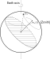

Effect: Diffraction
###################

When enterying the pupil plane, photons will be diffracted by the
struts of the spider. This leads to spikes in the image.

Contact person(s) if any:
-------------------------

Gerhard Bräunlich, Josh Meyers

Reference Material:
-------------------

`Coffey, Mahan, 1999 - Investigation Of Next-generation Earth
Radiation Budget Radiometry
<_thesis>`_: *Descripion of statistical 1-D diffraction*.

.. _thesis: https://ntrs.nasa.gov/citations/19990094899

Data Provenance:
----------------

Model Details:
--------------

`Coffey, Mahan <thesis_>`_ describe a statistical approach of photons
diffracted by entering a slit of thickness :math:`a`.
The heuristics is motivated by Heisenbergs uncertency principle
applied to the two variables :math:`\delta` and :math:`\Delta p_y`,
where :math:`\delta` denotes the distance from the point of entry to
the aperture edge and :math:`\Delta p_y` the uncertency of the photons
momentum in the direction perpendicular to the slit.

Using this heuristics, the authors derive a model, where photons are
diffracted by assigning to the photons new momenta :math:`\Delta p_y`
such that the statistical distribution of the diffraction angles
:math:`\phi_d` is given by

.. math::

   p(\tan(\phi_d)) = \frac{1}{\sqrt{2\pi} \phi^\ast} \exp\left[-\frac{1}{2} \left(\frac{\tan(\phi_d)}{\phi^\ast}\right)^2\right],

where :math:`k = \frac{2\pi}{\lambda}` and

.. math::

   \phi^\ast = \tan^{-1}\left( \frac{1}{2k \delta} \right).

In their thesis, the authors compared 4 different treatments of
the distance :math:`\delta`:

* Sum the resulting angles :math:`\phi_d` over edges (upper / lower),
* Duplicate ray on entrance, neglect one of the 2 edges for each ray,
* :math:`\delta := \min(\delta_+, \delta_-)`,
* :math:`\delta := \max(\delta_+, \delta_-)`,

Their conclusion is: sum approach is best.


Generalization to 2D apertures
``````````````````````````````

For the purpose of the diffraction caused by the spider, we extend the
above model from a rectangular aperture to a 2 dimensional aperture
resulting from combining circles and rectangles using geometric
boolean operations.

For a photon entering the pupil plane at :math:`\boldsymbol{r} = (x,y)`,
we define :math:`\delta = \delta(\boldsymbol{r})` to be
its distance to the boundary :math:`\partial A` of the aperture
:math:`A`.

.. math::

   \delta(\boldsymbol{r}) := \min_{\boldsymbol{s} \in
   \partial A}{\mathrm{dist}(\boldsymbol{r}, \boldsymbol{s})}.

This essentially corresponds to the variant :math:`\delta :=
\min(\delta_+, \delta_-)` in the original description.

Moreover instead of varying :math:`p_y`, we modify
:math:`\boldsymbol{p} = (p_x, p_y, p_z)` in the direction of the
normal :math:`\boldsymbol{n} \perp \partial A` at the point minimizing
the distance of :math:`\boldsymbol{r}` to :math:`\partial A`.


Field rotation
``````````````

When tracking a star with the telescope, the effect of field rotation
is addressed by rotating the camera. However rotating the spider is
not possible. As a result, the spider appears to rotate relative to
the picture.

In the simulation, this is implemented as follows.
Let :math:`\Delta \boldsymbol{p}(\boldsymbol{r}) = (\Delta p_x, \Delta p_y, \Delta
p_z)` be the change in momentum of a photon caused by the diffraction
by the spider at field rotation angle :math:`\alpha = 0` for a photon
entering the pupil plane at :math:`\boldsymbol{r} = (x, y)`.
Then, the change in momentum for the same photon, but for
:math:`\alpha \neq 0` is given by

.. math::

   R_\alpha^{-1} \Delta \boldsymbol{p}(R_\alpha \boldsymbol{r}).

Field rotation angle
~~~~~~~~~~~~~~~~~~~~

In a non-rotating reference system outside earth, let :math:`\boldsymbol{e}_*` be a star
on the celstial sphere and :math:`\boldsymbol{e}_r(t)` be the unit vector pointing to
zenith on some location on earth, at latitute :math:`\mathrm{lat}`.
If :math:`\Omega` is the rotation rate of earth and :math:`R_\phi`
denotes the rotation operator rotating around the earth axis with
angle :math:`\phi`, then
:math:`\boldsymbol{e}_r(t) = R_{\Omega t} \boldsymbol{e}_r(0)`.




   Earth-centered inertial, with :math:`\boldsymbol{e}_*` fixed on the
   celestial sphere and rotating :math:`\boldsymbol{e}_r(t)`
   (observers direction to zenith).

Then the "horizontal" direction :math:`\boldsymbol{e}_h(t)` as observed from the
given location on the earth through the star is given by

.. math::

   \boldsymbol{e}_h(t) = \frac{\boldsymbol{e}_* \times \boldsymbol{e}_r(t)}{\|\boldsymbol{e}_* \times \boldsymbol{e}_r(t)\|}.


The field rotation angle :math:`\alpha(t)` at time
:math:`t` relative to :math:`t=0` corresponds to the angle between
:math:`\boldsymbol{e}_h(0)` and :math:`\boldsymbol{e}_h(t)`:

.. math::
   :label: cos_alpha

   \cos(\alpha(t)) = \langle \boldsymbol{e}_h(0), \boldsymbol{e}_h(t) \rangle
   = \frac{\langle \boldsymbol{e}_* \times \boldsymbol{e}_r(0),
   \boldsymbol{e}_* \times \boldsymbol{e}_r(t)
   \rangle}{\|\boldsymbol{e}_* \times \boldsymbol{e}_r(0)\| \cdot \|\boldsymbol{e}_* \times \boldsymbol{e}_r(t)\|},

and

.. math::

   |\sin(\alpha(t))| = \| \boldsymbol{e}_h(0) \times \boldsymbol{e}_h(t) \|.

To also preserve the sign, instead of taking the length of the cross
product, we also can project the cross product to its own direction
which is :math:`\boldsymbol{e}_*` (both :math:`\boldsymbol{e}_h(t)`
and :math:`\boldsymbol{e}_h(0)` are tangent vectors at
:math:`\boldsymbol{e}_*`):

.. math::
   :label: sin_alpha

   \sin(\alpha(t)) = \langle \boldsymbol{e}_*, \boldsymbol{e}_h(0)
   \times \boldsymbol{e}_h(t) \rangle
    = \frac{
        \langle \boldsymbol{e}_r(t), \boldsymbol{e}_* \times \boldsymbol{e}_r(0) \rangle
      }{
        \| \boldsymbol{e}_* \times \boldsymbol{e}_r(0) \|
        \cdot \| \boldsymbol{e}_* \times \boldsymbol{e}_r(t) \|
      },

using

.. math::
   \langle \boldsymbol{e}_*, (\boldsymbol{e}_* \times \boldsymbol{e}_r(0))
     \times (\boldsymbol{e}_* \times \boldsymbol{e}_r(t)) \rangle
     = \langle \boldsymbol{e}_r(t), \boldsymbol{e}_* \times \boldsymbol{e}_r(0) \rangle.


Field rotation rate
~~~~~~~~~~~~~~~~~~~

The form :eq:`sin_alpha` is convenient to derive the equation [1]_

.. math::

   \dot{\alpha}(0) = \Omega \cos(\mathrm{lat}) \frac{\cos(\mathrm{az}_*)}{\cos(\mathrm{alt}_*)},

using

.. math::

   \dot{\alpha}(0)
   = \cos(\alpha(0)) \dot{\alpha}(0)
   = \left[ \frac{d}{dt}(\sin(\alpha(t))) \right]_{t=0}
   = \left[ \frac{d}{dt}
      \frac{
        \langle \boldsymbol{e}_r(t), \boldsymbol{e}_* \times \boldsymbol{e}_r(0) \rangle
      }{
        \| \boldsymbol{e}_* \times \boldsymbol{e}_r(0) \|
        \cdot \| \boldsymbol{e}_* \times \boldsymbol{e}_r(t) \|
      }
     \right]_{t=0}

and

.. math::

   \cos(\mathrm{alt}_*) = \| \boldsymbol{e}_* \times \boldsymbol{e}_r(0) \|,

.. math::

   \dot{\boldsymbol{e}_r}(t) = \Omega \cos(\mathrm{lat}) \boldsymbol{e}_\phi(t),

.. math::

   \cos(\mathrm{az}_*) = \frac{\langle \boldsymbol{e}_*, \boldsymbol{e}_\theta(0) \rangle}{\| \boldsymbol{e}_* \times \boldsymbol{e}_r(0) \|},


:math:`\boldsymbol{e}_\theta`, :math:`\boldsymbol{e}_\phi` being the
unit surface directions on earth pointing to north, east respectively.

Equatorial coordinate system
~~~~~~~~~~~~~~~~~~~~~~~~~~~~

In imsim, we use an equatorial coordinate system to compute the field
rotation:
* :math:`\boldsymbol{e}_z`: Earth axis,
* :math:`\boldsymbol{e}_x`: Location of observer projected to the equatorial plane,
* :math:`\boldsymbol{e}_x`: Orthonormal complement of :math:`\boldsymbol{e}_x` and :math:`\boldsymbol{e}_z`.

There, we have:

.. math::

   \boldsymbol{e}_r(t) = \left(\begin{array}[c] \\
         \cos(\Omega t)\cos(\mathrm{lat}) \\
         \sin(\Omega t)\cos(\mathrm{lat}) \\
         \sin(\mathrm{lat})
         \end{array}\right)

.. math::

   \boldsymbol{e}_* = \cos(\mathrm{alt}_*) \sin(\mathrm{az}_*) \boldsymbol{e}_E \\
     + \cos(\mathrm{alt}_*) \cos(\mathrm{az}_*) \boldsymbol{e}_N \\
     + \sin(\mathrm{alt}_*) \boldsymbol{e}_r(0),

where :math:`\boldsymbol{e}_E = (0, 1, 0)`
and :math:`\boldsymbol{e}_N = \boldsymbol{e}_r(0) \times \boldsymbol{e}_E`.

.. [1] https://calgary.rasc.ca/field_rotation.htm

Validation Criteria:
--------------------

Validation Results:
-------------------

Relevant Project Team for input if any:
---------------------------------------

Release and approval log:
-------------------------

07/09/2022 - Initial version - Gerhard Bräunlich, Josh Meyers

xx/xx/2022 - Add field rotation to the spikes - Gerhard Bräunlich
