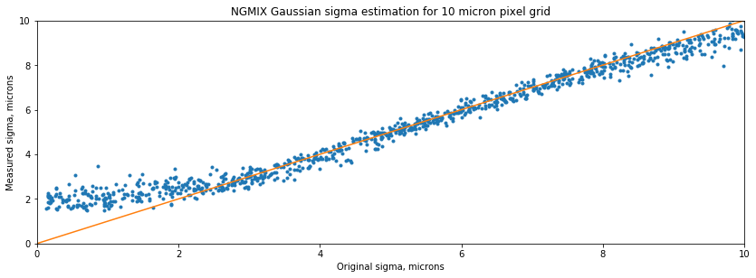
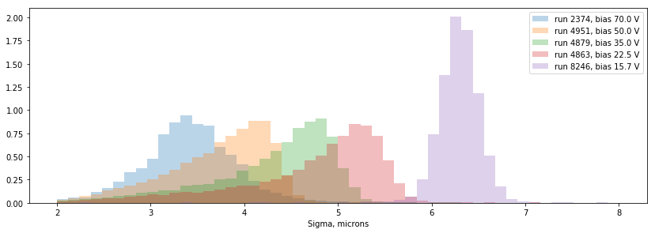
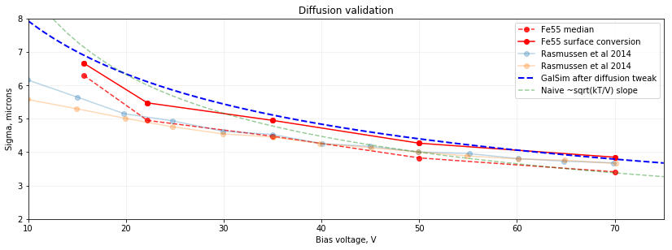

Effect: Diffusion
#################

During the propagation of electrons inside the silicon, they are
repeatedly scattered that leads to their displacement in the pixel
plane.

Contact person(s) if any:
-------------------------

Craig Lage, Andrei Nomerotski/SAWG

Reference Material:
-------------------

Description of theoretical model used to estimate electron diffusion
amplitude is given in Craig Lage'
`document <https://github.com/karpov-sv/Poisson_CCD22/raw/hole20/docs/BF_WP_11Nov16.pdf>`_
on Poisson\_CCD22 low-level simulator.
Discussion of whether this model properly describes the diffusion of
Fe66 hits seen in the experiments is presented in the following talks
by Sergey Karpov -
`1 <https://confluence.slac.stanford.edu/download/attachments/229017346/Karpov_Diffusion_in_Poisson_Simulator.pdf?version=1&modificationDate=1527604748000&api=v2>`_,
`2 <https://confluence.slac.stanford.edu/download/attachments/229017346/Karpov_Diffusion_in_Poisson_Simulator_cont.pdf?version=3&modificationDate=1530023967000&api=v2>`_
and by Craig Lage -
`3 <https://confluence.slac.stanford.edu/download/attachments/236503647/SAWG_Fe55_10Aug18.pdf?version=1&modificationDate=1533923443000&api=v2>`_.

Also some information, including previous efforts of measuring voltage dependency of diffusion, is available in the Andy Rasmussen article `4 <https://arxiv.org/pdf/1407.5655.pdf>`_

Data Provenance:
----------------

Data for validation are taken from the following sensors tested at BNL
under different bias voltages:

- ITL-3800C-092
- ITL-3800C-095
- ITL-3800C-307
- E2V-CCD250-107

Model Details:
--------------

The amount of diffusion to apply was defined in
`GalSim:galsim/sensor.py
<https://github.com/GalSim-developers/GalSim/blob/master/galsim/sensor.py>`_,
inside **_calculate_diff_step** function.
Before Aug 8, 2018, it was defined as

.. code-block:: python

   # 0.026 is kT/q at room temp (298 K)
   diff_step = np.sqrt(2 * 0.026 * CCDTemperature / 298.0 / Vdiff) * SensorThickness

It implemented the diffusion model explained in detail in Appendix E
of `this document
<https://github.com/craiglagegit/Poisson_CCD22/raw/hole20/docs/BF_WP_11Nov16.pdf>`_.

This model is `known
<https://confluence.slac.stanford.edu/download/attachments/229017346/Karpov_Diffusion_in_Poisson_Simulator.pdf?version=1&modificationDate=1527604748000&api=v2>`_
to underestimate the diffusion by ~2 times in respect to experimental
data on Fe55 hits, so the use of an effective electron mass correction
from `Green (1989) <https://doi.org/10.1063/1.345414>`_ has been
proposed by Craig Lage.

Since Aug 8, it is implemented as:

.. code-block:: python

    # Set up the diffusion step size at the operating temperature
    # First, calculate the approximate front side voltage
    VChannelStop = qfh # near zero
    VCollect = Vparallel_hi + 12.0 # Estimate from simulation
    VBarrier = Vparallel_lo + 15.0 # Estimate from simulation
    ChannelStopRegionWidth = 2.0 * (ChannelStopWidth / 2.0 + FieldOxideTaper)
    ChannelStopRegionArea = ChannelStopRegionWidth * PixelSize
    CollectArea = (PixelSize - ChannelStopRegionWidth) * PixelSize * CollectingPhases / NumPhases
    BarrierArea = (PixelSize - ChannelStopRegionWidth) * PixelSize * (NumPhases - CollectingPhases) / NumPhases
    Vfront = (ChannelStopRegionArea * VChannelStop + CollectArea * VCollect + BarrierArea * VBarrier) / (PixelSize**2)
    # Then, the total voltage across the silicon
    Vdiff = max(Vfront - Vbb, 1.0) # This just makes sure that Vdiff is always > 1.0V
    MobilityFactor = 0.27 # This is the factor from Green et.al.
    # 0.026 is kT/q at room temp (298 K)
    diff_step = np.sqrt(2 * 0.026 * CCDTemperature / 298.0 / Vdiff / MobilityFactor) * SensorThickness

This implements both the effective mass correction (through
MobilityFactor multiplier), and the adjustments for *Vfront*  front
voltage based on simulations using the peak voltage at ~1 um above the
bottom.

The ``diff_step`` value computed above describes the diffusion for
outer surface electron conversion. If the electron is generated at
some depth inside the silicon, the value is scaled down as

.. code-block:: python

    diffusion = diff_step * sqrt(1 - ConversionDepth/SensorThickness)

This is done inside ``Silicon::accumulate()`` method of GalSim ``Silicon.cpp``.

Validation Criteria:
--------------------

The amount of diffusion under different experimental setups is
measured by fitting the Fe55 hit marks in acquired images with
Gaussian model using `NGMIX <https://github.com/esheldon/ngmix>`_ code
by Erin Sheldon. The validity of fitting procedure for significantly
undersampled case of Fe55 hits has been specifically studied by
generating and pixelizing the clouds of electrons with different sizes
and sub-pixel center positions, fitting them in the same way as Fe55
hits, and then comparing the results with original sizes. The
procedure has been found to be unbiased in the parameter region of
interest for Fe55 fitting, and therefore applicable for the
validation.

   Validation of NGMIX Gaussian fitter

The following distributions have been obtained for the sizes of Fe55
hits (selecting only the events corresponding to main Kalpha intensity
peak) under different bias voltages on different CCDs:

   Sizes of Fe55 hits under different voltages

The following table summarizes these distributions in terms of median
(which corresponds to the ~28 um mean conversion depth of Fe55 x-ray
photons in silicon) and surface conversion diffusion values:

.. table::
   :widths: auto

   ==========  ==========  ==============  ====================  ================================
   Voltage, V  Run Number  Sensor          Median diffusion, um  Surface conversion diffusion, um
   ==========  ==========  ==============  ====================  ================================
   15.7        8246        ITL-3800C-307   6.3                   6.66
   22.2        4863        ITL-3800C-092   4.95                  5.47
   35          4879        ITL-3800C-092   4.48                  4.95
   50          4951        ITL-3800C-095   3.83                  4.27
   70          2374        E2V-CCD250-107  3.41                  3.85
   ==========  ==========  ==============  ====================  ================================

The latter is derived from fitting the distributions with the model
consisting of exponentially distributed conversion depth and gaussian
scatter of measured sigmas. Details of the fits are shown `here
`_. Lowest and
highest voltages fits are probably not completely reliable as the
histograms deviate from expected shape. All other voltages are
described quite well by such simple model.

Moreover, the data on surface conversion diffusion acquired earlier
and published in `Rasmussen et al (2014)
<https://arxiv.org/pdf/1407.5655.pdf>`_ are also used for qualitative
validation.

Validation Results:
-------------------

Since Aug 8, 2018 GalSim uses the diffusion model that is mostly
consistent with the Fe55 results shown above.

   Comparison of the GalSim diffusion amplitude with the sizes of Fe55 hits for different
   bias voltages

Small discrepancy is seen for lower voltages and is most probably
related to unoptimal ``Vfront`` adjustment.

Relevant Project Team for input if any:
---------------------------------------

Camera

Release and approval log:
-------------------------

07/20/18 - Initial Version - Sergey Karpov

08/08/18 - Update for a new diffusion model committed by Craig Lage - Sergey Karpov
