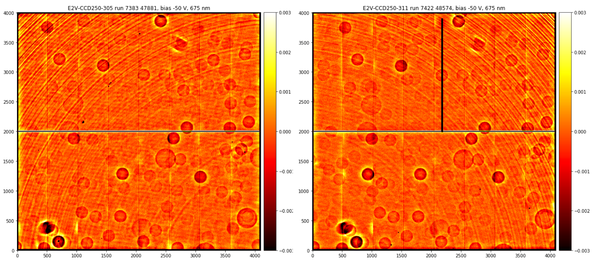
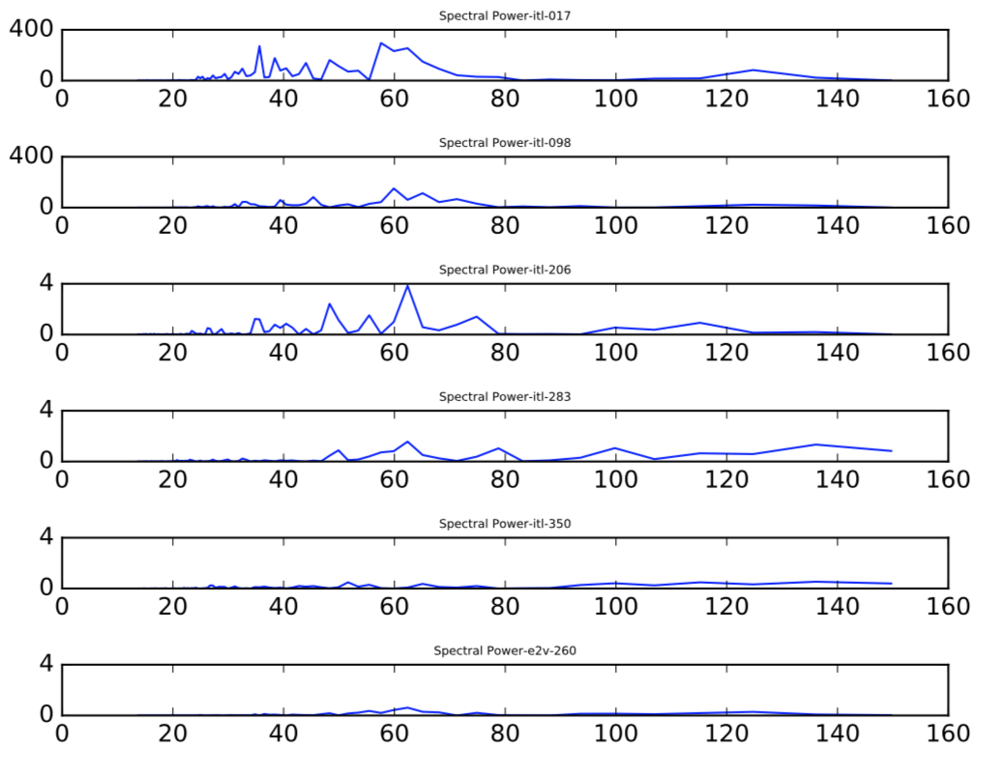
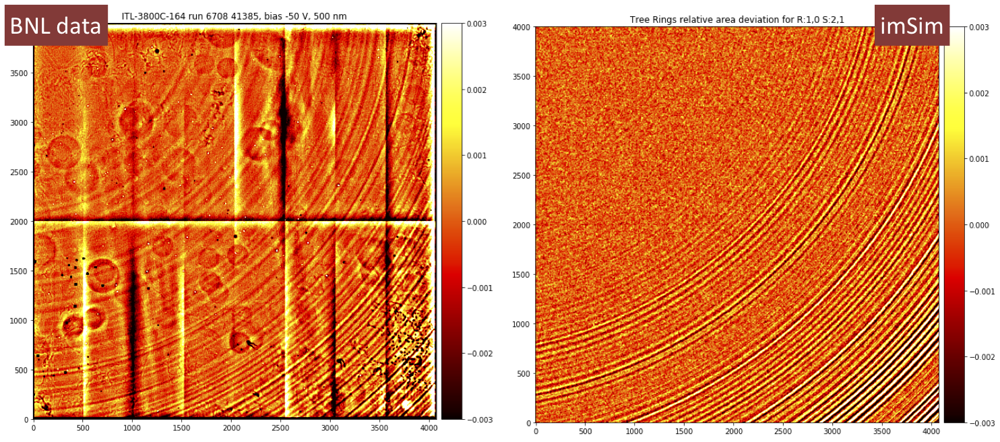
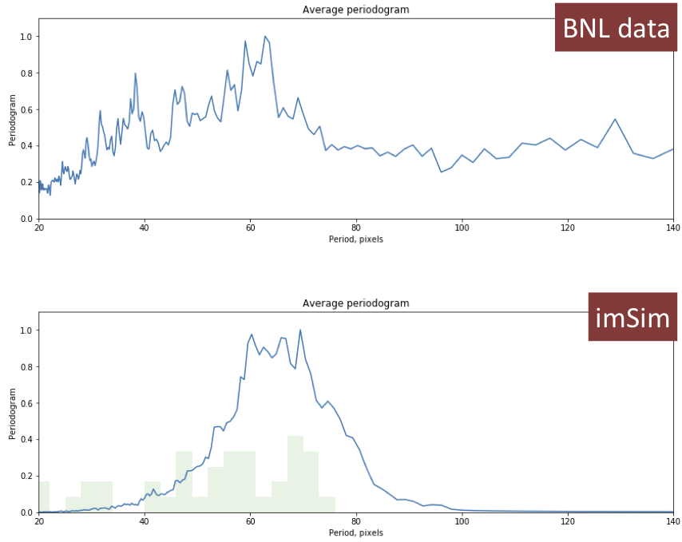
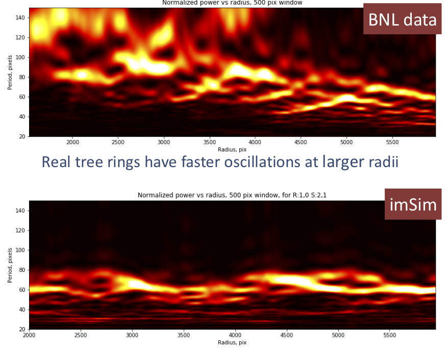
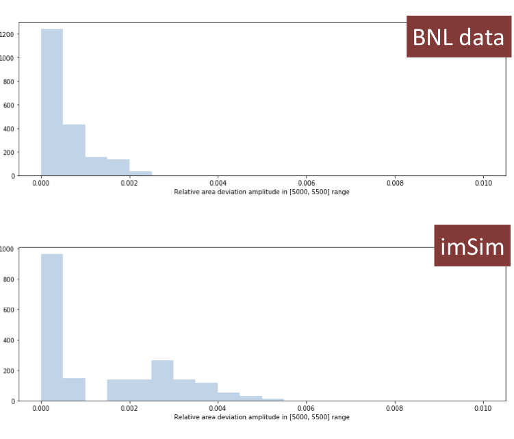
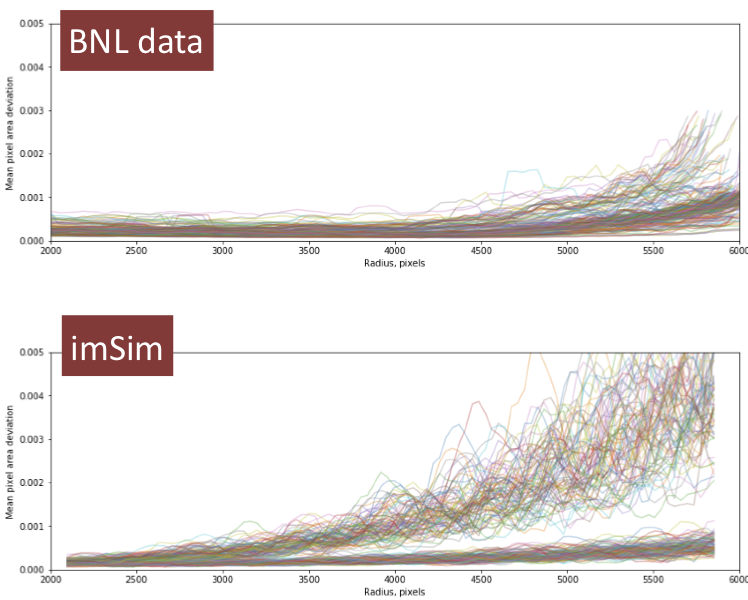

Effect: Tree rings
##################

During the growing of silicon boules the doping percentage can vary
over time building "tree-ring" like structure in doping
concentration. Much like a n-p junction, the gradient in doping
establishes a static lateral electric field causing electrons to drift
laterally into adjacent pixels while traveling through the silicon
bulk. It leads to position-dependent distortions of the images, as
well as to periodic intensity variations in flat fields.

    Typical tree rings seen in flatfields

For a more thorough introduction see e.g.
`Okura et al. (2015) <https://arxiv.org/abs/1504.05614>`_.

Contact person(s) if any:
-------------------------

Craig Lage, Mike Jarvis, Andrei Nomerotski/SAWG

Reference Material:
-------------------

See recent talk by Craig Lage `here
<https://confluence.slac.stanford.edu/download/attachments/229017346/Karpov_Treerings_in_Data_2.pdf?version=2&modificationDate=1526392245000&api=v2>`__

Tree rings analysis using BNL data by Sergey Karpov is `here
<https://confluence.slac.stanford.edu/download/attachments/229017346/Karpov_Treerings_in_Data_2.pdf?version=2&modificationDate=1526392245000&api=v2>`__

Another review of tree rings in BNL sensors by Hye-Yun Park is `here
<https://confluence.slac.stanford.edu/download/attachments/236503590/tree_rings_DESC_CMU.pdf?version=1&modificationDate=1532465107000&api=v2>`__

Data Provenance:
----------------

The model is validated using the data acquired at BNL on TS3 (30 ITL,
37 E2V sensors, 106 runs in total) and on TS8 (39 ITL, 72 E2V sensors,
496 runs in total).

All data are available on ASTRO cluster in BNL at:
*/gpfs01/astro/workarea/ccdtest/prod*

The model parameters

Model Details:
--------------

The tree rings are typically seen in flat field images where they
represent the effective pixel area variation (or the Jacobian of
coordinate transformation). On the other hand, for efficient
simulation of data the coordinate distortion function is
necessary. Therefore, it is decided to build an analytical model for
radial coordinate displacement, and then compute pixel area variation
from it.

The following model is selected to represent the effect:

.. math::

   \delta r = \left( \sum \sin(\omega_i r + \phi_i)/\omega_i - \sum
   \cos(\omega_i r + \phi_i)/\omega_i\right) \cdot (A+Br^4)

Polynomial term describes the increase of tree rings amplitude with
moving away from the center.
Corresponding area variation is then

.. math::

   \delta S = \left( \sum \cos(\omega_i r + \phi_i) + \sum
   \sin(\omega_i r + \phi_i)\right) \cdot (A+Br^4)

The parameters are chosen based on data acquired by Hye-Yun Park on
TS3 for 5 ITL and 1 E2V sensors, available `here
<https://github.com/LSSTDESC/imSim/blob/master/data/tree_ring_data/BNL_data.tar.gz>`__.

    Input data used for selection of tree ring parameters

The parameters are randomly generated for all sensors using
`build_tree_ring_file.py
<https://github.com/LSSTDESC/imSim/blob/master/data/tree_ring_data/build_tree_ring_file.py>`_
script according to the following rules:

* 15 sine + 15 cosine frequencies (with random phases) normally
  distributed with mean 60 pix and sigma 10 pix
* 5 sine + 5 cosine frequencies (with random phases) normally
  distributed with mean 35 pix and sigma 10 pix
* 60% sensors have small amplitudes, 40% - large (order of magnitude
  larger) amplitudes, uniformly distributed with ~2 times spread.

Actual parameters pre-generated for all sensors are stored in
`tree_ring_parameters_2018-04-26.txt
<https://github.com/LSSTDESC/imSim/blob/master/data/tree_ring_data/tree_ring_parameters_2018-04-26.txt>`_. The
code in `imsim/tree_rings.py
<https://github.com/LSSTDESC/imSim/blob/master/python/desc/imsim/tree_rings.py>`_
reads this file, constructs radial displacement function and passes it
to ``galsim.SiliconSensor`` constructor in `galsim/sensor.py
<https://github.com/GalSim-developers/GalSim/blob/master/galsim/sensor.py>`_. Then
the low-level C++ code in `Silicon.cpp
<https://github.com/GalSim-developers/GalSim/blob/master/src/Silicon.cpp>`_
uses it for actual displacement of incoming photons, applying also
conversion depth correction to it (so the electrons converted deeper
have smaller displacement). The latter is handled by
``Silicon::insidePixel`` method.

Validation Criteria:
--------------------

The validation is based on an uniform analysis of flat fields from
large set of CCDs studied at BNL on TS3 and TS8. The superflats have
been created from all available flat field frames, and then processed
using the code published `here
<https://github.com/karpov-sv/lsst-misc/blob/master/Tree_Rings_Analysis.ipynb>`__.
Processing consisted of high-pass filtering of superflats, artefact
and noise masking, automatic determination of tree rings center, and
derivation of an angle-averaged relative intensity variation as a
function of radius.

The simulated data have been generated for all 189 different *imSim*
sensor configurations using analytic formulae for pixel area
variations shown above.

The following criteria are used for comparison of simulated and
experimental data:

* Visual comparison of flat fields
* Average periodograms
* Radius-dependent frequency structure (radius-resolved periodogram)
* Distribution of amplitudes at fixed radius
* Radial dependence of amplitude, estimated through sliding window
  sample variance corrected to sine wave amplitude using ``sqrt(2)``
  coefficient.

Validation Results:
-------------------

Simulated flat fields
~~~~~~~~~~~~~~~~~~~~~

    Comparison of simulated flats to actual ITL sensor data

Simulated flat field (right) looks quite similar to the actual one
acquired on TS3 at BNL (left). Color-coded are relative intensity
variations corresponding to effective pixel area changes due to
electron displacement.

Average periodograms
~~~~~~~~~~~~~~~~~~~~

    Comparison of periodograms of simulated and actual data

Average periodograms of simulated data (lower) are generally
consistent with experimental data (upper panel) except for a slight
shift of main peak to longer periods and the absence of lower-period
excess seen in actual data.
The latter is despite the presence of actual frequencies there in
simulation (see overplotted histogram of simulated frequency
components in the lower panel).

Radius-resolved periodograms
~~~~~~~~~~~~~~~~~~~~~~~~~~~~

    Comparison of radius-resolved periodograms of simulated and actual data

Radius-resolved periodograms of actual data (upper) show signs of an
evolution of primary frequencies with radius - on smaller radii
periods of oscillations are larger, tree rings appear "smoother" than
on larger radii. This may also be seen visually in the flat fields
above. Radius-resolved periodograms of simulated data are flat, as
expected from the underlying model.

Amplitudes at fixed radius
~~~~~~~~~~~~~~~~~~~~~~~~~~

    Comparison of amplitudes of simulated and actual data

Amplitudes estimated as a sample variance between 5000 and 5500 pixels
radii (multiplied by ``sqrt(2)`` to convert to sine wave amplitude) of
simulated data (lower panel) show characteristic two-peak structure
due to underlying model which includes 60% lower-amplitude sensors and
40% higher amplitude ones. Actual experimental data (upper) show
smooth, continuous distribution of amplitudes instead, with smaller
amount of higher amplitude sensors than simulated.

Radial dependence of amplitudes
~~~~~~~~~~~~~~~~~~~~~~~~~~~~~~~

    Comparison of radial amplitudes of simulated and actual data

Radial dependence of aplitude, estimated by a sliding window sample
variance (multiplied by ``sqrt(2)`` to convert to sine wave amplitude)
of simulated data (lower) show the same characteristic two sets
distribution due to underlying model. It also shows generally smoother
growth with radius than experimental data (upper) - experimental data
seem to grow faster with radius, probably with polynomial degree
larger than 4 used in the model.

Conclusions
~~~~~~~~~~~

Overall properties of simulated tree rings look qualitatively similar
to actual ones of sensors measured at BNL, with some minor properties
missing (radial dependence of primary frequencies, radual dependence
of amplitudes).

Relevant Project Team for input if any:
---------------------------------------

Camera

Release and approval log:
-------------------------

03/30/18 - Initial Version - CWW

08/11/18 - Updated version with more details on model and validation - Sergey Karpov
